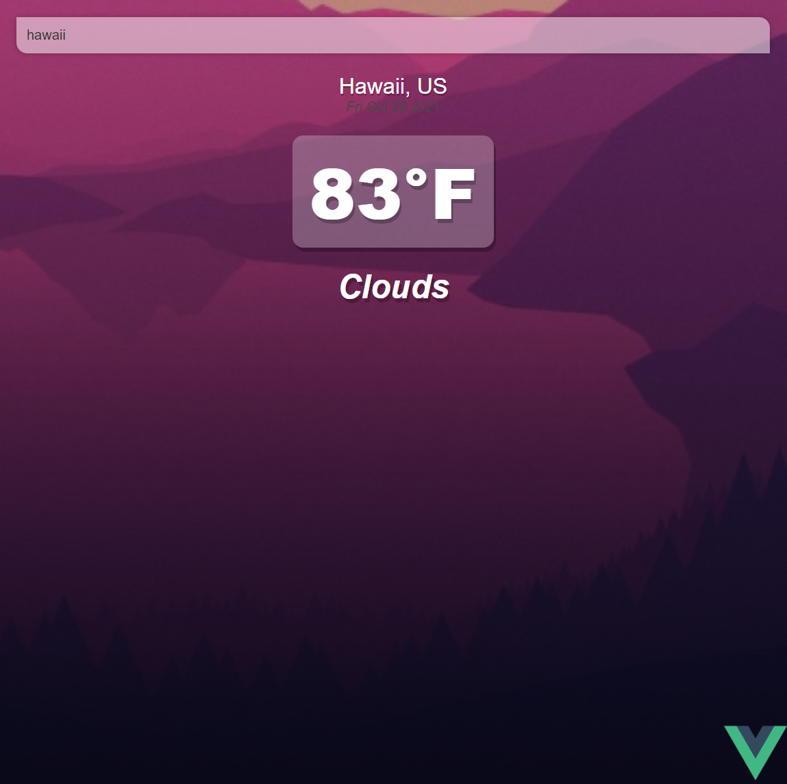

# VUE - Weather App

deployed link (https://sjk-vue-weather-app.netlify.app/)

## Description

Simple weather app built with VUE.js open-weather-api and deployed with netlify.

## Project Demo

- Locations with low temperatures will show blue background.
  

- Locations with high temperatures will show red background.
  

## Project setup

```
npm install
```

### Compiles and hot-reloads for development

```
npm run serve
```

### Compiles and minifies for production

```
npm run build
```

### Lints and fixes files

```
npm run lint
```

### Customize configuration

See [Configuration Reference](https://cli.vuejs.org/config/).
